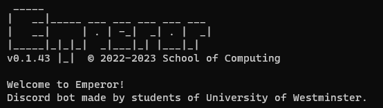

<!-- Improved compatibility of back to top link: See: https://github.com/othneildrew/Best-README-Template/pull/73 -->
<a name="readme-top"></a>
<!--
*** https://www.markdownguide.org/basic-syntax/#reference-style-links
-->

<!-- PROJECT SHIELDS -->
[![Contributors - Work in Progress][contributors-shield]][contributors-url]
[![Forks - Work in Progress][forks-shield]][forks-url]
[![Stargazers - Work in Progress][stars-shield]][stars-url]
[![Issues][issues-shield]][issues-url]

<!-- PROJECT LOGO -->
<br />
<div align="center">
  <a href="https://github.com/UOW-Computing/Emperor">
    
  </a>

<h3 align="center">Emperor, a discord bot from students of University of Westminster.</h3>

  <p align="center">
    General purpose Discord bot used for School of Computing discord server.  
    Built by students, for students.
    <br />
    <br />
    <br />
    <a href="https://github.com/UOW-Computing/Emperor">View Demo</a>
    ·
    <a href="https://github.com/UOW-Computing/Emperor/issues">Report Bug</a>
    ·
    <a href="https://github.com/UOW-Computing/Emperor/issues">Request Feature</a>
  </p>
</div>

<!-- TABLE OF CONTENTS -->
<details>
  <summary>Table of Contents</summary>
  <ol>
    <li>
      <a href="#about-the-project">About The Project</a>
      <ul>
        <li><a href="#built-with">Built With</a></li>
      </ul>
    </li>
    <li>
      <a href="#getting-started">Getting Started</a>
      <ul>
        <li><a href="#prerequisites">Prerequisites</a></li>
        <li><a href="#installation">Installation</a></li>
      </ul>
    </li>
    <li><a href="#usage">Usage</a></li>
    <li><a href="#roadmap">Roadmap</a></li>
    <li><a href="#contributing">Contributing</a></li>
    <li><a href="#contact">Contact</a></li>
    <li><a href="#acknowledgments">Acknowledgments</a></li>
  </ol>
</details>

<!-- ABOUT THE PROJECT -->
## About The Project
  <a href="https://github.com/UOW-Computing/Emperor">
    

<p align="right">(<a href="#readme-top">back to top</a>)</p>

### Built With

* [![Python][JQuery.com]][JQuery-url]

<p align="right">(<a href="#readme-top">back to top</a>)</p>

<!-- GETTING STARTED -->
## Getting Started

This is an example of how you may give instructions on setting up your project locally.
To get a local copy up and running follow these simple example steps.

### Prerequisites

Currently Emperor is not a working package, therefore it cannot automatically install dependencies.  
Install them manually using the command below.  

Requirements.txt install all dependencies to your environment before starting the project.
* requirements.txt
  ```sh
  pip install -r requirements.txt
  ```

### Installation

1. Before running the modules(commands), make sure to have a bot ready with its token copied.  
2. You can create one here: [Discord Application](https://discord.com/developers/applications/). This will generate your bot token.  
3. Once you have a `TOKEN ID`,`GUILD ID` `CHANNEL ID`,[Discord Application](https://discord.com/developers/applications/).
4. Clone this repo
   ```sh
   git clone https://github.com/UOW-Computing/Emperor.git
   ```
5. Install requirements.txt inside your terminal
   ```sh
   python3 -m pip install -r requirements.txt
   ```
6. Run `setup.py`, this will generate the `.env` file. Emperor does not work without this file.  
   ```sh
   python3 setup.py
   ```
7. Once the `.env` has been generated, close this terminal. Open a new one and run `main.py` 
   ```sh
   python3 main.py
   ```

   Happy Programming ;) 

<p align="right">(<a href="#readme-top">back to top</a>)</p>


<!-- USAGE EXAMPLES -->
## Usage
This is a work in progress.  

### Moderation Commands

- `ticket create`: Creates a channel exclusive to the ticket creater and staff members
- `ticket close`: Closes a ticket channel

### General Commands

- `hello`: Says hello back to you
 - `info server`: Gives info of the server in which it was executed in
 - `info member`: Gives information about the member mentioned

### API Commands

- `reddit`: Responds with a post in the subreddit given

<p align="right">(<a href="#readme-top">back to top</a>)</p>


<!-- ROADMAP -->
## Roadmap
- [ ]  Add Lj logging into Ticket command
- [ ] Rewrite clear as purge command for discord.py
- [ ] Handle attachmens on on_message event
- [ ] Turn createrole into sub commands of their own respective command, create role for createrole
- [ ] Introduce CHANGELOG.md
- [ ] Better error handling than just Lj
- [ ] Add database into Lj for logging and server backups

See the [open issues](https://github.com/UOW-Computing/Emperor/issues) for a full list of proposed features (and known issues).

<p align="right">(<a href="#readme-top">back to top</a>)</p>


<!-- CONTRIBUTING -->
## Contributing

Contributions are what make the open source community such an amazing place to learn, inspire, and create.  
Even the smallest contribution matters.
Any contributions you make are **greatly appreciated!!!**.

If you have a suggestion that would make this better, please fork the repo and create a pull request.  
You can also simply open an issue with the tag "enhancement".  
You can also ask for help/ideas through opening an issue.  

Don't forget to give the project a star! Thanks again!  

1. Fork the Project
2. Create your Feature Branch (`git checkout -b feature/AmazingFeature`)
3. Commit your Changes (`git commit -m 'Add some AmazingFeature'`)
4. Push to the Branch (`git push origin feature/AmazingFeature`)
5. Open a Pull Request

<p align="right">(<a href="#readme-top">back to top</a>)</p>

<!-- CONTACT -->
## Contact

Project Link: [https://github.com/UOW-Computing/Emperor](https://github.com/UOW-Computing/Emperor)

Project Lead Contributor - [.nukestye](https://github.com/Nukestye)  
Project Contributor - [Breno](https://github.com/brenobaise)  
Project Contributor - [Yhuen](https://github.com/yhuen24)  
Project Contributor - [Nakano](https://github.com/NakanoYusui)  


<p align="right">(<a href="#readme-top">back to top</a>)</p>

<!-- ACKNOWLEDGMENTS -->
## Acknowledgments

* [School of Computing UOW TEAM](https://github.com/UOW-Computing)
* [README Template from](https://github.com/othneildrew/Best-README-Template)

<!-- Notes -->
## Notes for editors

> Need to add instructions on how to fork/git init the project enviroment.  
> Need to add explanations on how to get log_channel_id, guild_id, token ?  
> ReadME has to be updated, TODO's, etc...  
> If you want to contribute by editing the README, contact Breno.

<p align="right">(<a href="#readme-top">back to top</a>)</p>

<!-- MARKDOWN LINKS & IMAGES -->
<!-- https://www.markdownguide.org/basic-syntax/#reference-style-links -->
[contributors-shield]: https://img.shields.io/github/contributors/UOW-Computing/Emperor.svg?style=for-the-badge
[contributors-url]: https://github.com/UOW-Computing/Emperor/graphs/contributors
[forks-shield]: https://img.shields.io/github/forks/UOW-Computing/Emperor.svg?style=for-the-badge
[forks-url]: https://github.com/UOW-Computing/Emperor/network/members
[stars-shield]: https://img.shields.io/github/stars/UOW-Computing/Emperor.svg?style=for-the-badge
[stars-url]: https://github.com/UOW-Computing/Emperor/stargazers
[issues-shield]: https://img.shields.io/github/issues/UOW-Computing/Emperor.svg?style=for-the-badge
[issues-url]: https://github.com/UOW-Computing/Emperor/issues
[product-screenshot]: res/screenshot.png

[JQuery.com]: https://img.shields.io/badge/jQuery-0769AD?style=for-the-badge&logo=jquery&logoColor=white
[JQuery-url]: https://jquery.com 
